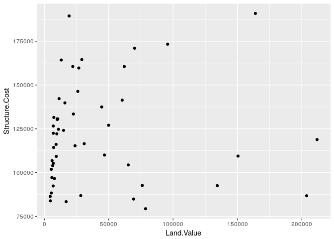
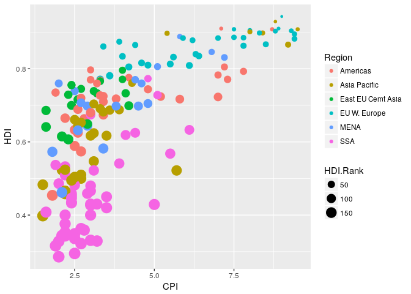
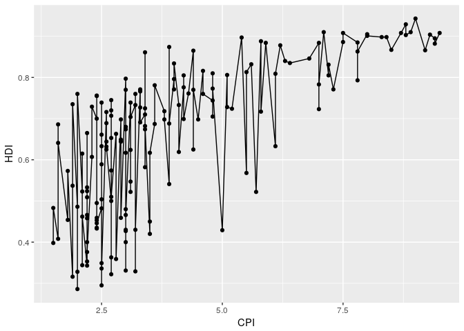
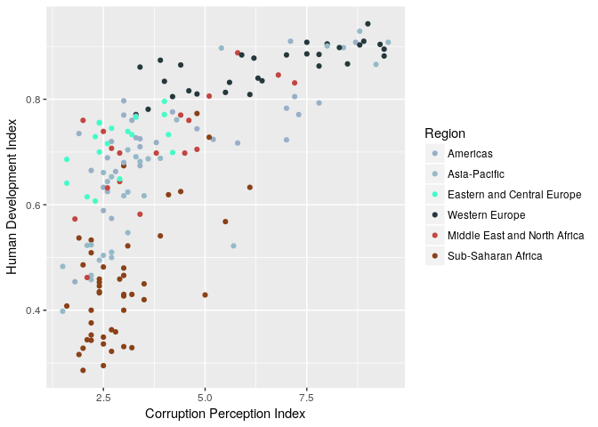
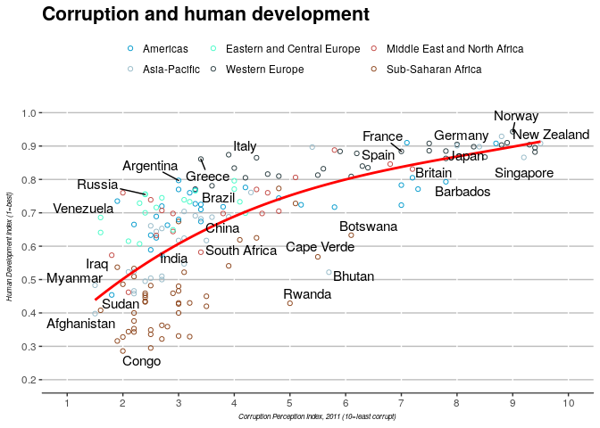

    library(ggplot2)

    # reading in housing data
    housing <- read.csv("Rgraphics/dataSets/landdata-states.csv")
    head(housing[1:5])

    ##   State region    Date Home.Value Structure.Cost
    ## 1    AK   West 2010.25     224952         160599
    ## 2    AK   West 2010.50     225511         160252
    ## 3    AK   West 2009.75     225820         163791
    ## 4    AK   West 2010.00     224994         161787
    ## 5    AK   West 2008.00     234590         155400
    ## 6    AK   West 2008.25     233714         157458

    # showing the first 5 columns

Comapring base and `ggplot2`
----------------------------

### Histograms

    # compare base vs ggplot2
    hist(housing$Home.Value)

    # not a very inspiring chart

    library(ggplot2)
    ggplot(housing, aes(x = Home.Value)) + geom_histogram()

    ## `stat_bin()` using `bins = 30`. Pick better value with `binwidth`.

    # more verbose but prettier chart
    # syntax is ggplot(file, values to be displayed, type of chart)
    # aes refers to aesthetics which are defined by the user

### Line charts

    # Base example
    plot(Home.Value ~ Date,
         data=subset(housing, State == "MA"))
    # no information on color added
    points(Home.Value ~ Date, col="red",
           data=subset(housing, State == "TX"))
    # here we use points() to add a second data layer
    legend(1975, 400000,
           c("MA", "TX"), title="State",
           col=c("black", "red"),
           pch=c(1, 1))

    ## ggplot2
    ggplot(subset(housing, State %in% c("MA", "TX")),
           aes(x=Date,
               y=Home.Value,
               color=State))+
      geom_point()

    # much simpler code. ggplot2 seems to be simpler when dealing with multiple points. The output is also much prettier! geom_ changes the type of plot. We can use geom_line for example; this provides a cleaner chart.

    ggplot(subset(housing, State %in% c("MA", "TX")),
           aes(x=Date,
               y=Home.Value,
               color=State))+
      geom_line()

    # We add a geom to a plot using the + operator 

### Scatterplot

    hp2001Q1 <- subset(housing, Date == 2001.25) 
    # defining hp2001Q1 as house prices for Q1 of 2001 which is recorded as 2001.25 in the dataset
    ggplot(hp2001Q1,
           aes(y = Structure.Cost, x = Land.Value)) +
      geom_point()

    ggplot(hp2001Q1,
           aes(y = Structure.Cost, x = log(Land.Value))) +
      geom_point()

    # using log transformation for land value

    # adding another dimension and a prediction line
    hp2001Q1$pred.SC <- predict(lm(Structure.Cost ~ log(Land.Value), data = hp2001Q1))
    # adding prediction data
    p1 <- ggplot(hp2001Q1, aes(x = log(Land.Value), y = Structure.Cost))
    # assigning land value and structure cost data to p1
    p1 + geom_point(aes(color = Home.Value)) +
      geom_line(aes(y = pred.SC))

    # adding home value data to points; adding legend and creating chart
    # can use xlab and ylab to change labels

    # adding a line and ribbon
    p1 +
      geom_point(aes(color = Home.Value)) +
      geom_smooth()

    ## `geom_smooth()` using method = 'loess'

### Labeling points

    p1 + 
      geom_text(aes(label=State), size = 3)

    # p1 was defined in the previous chunk of code. this does not include the points, just the labels

    library("ggrepel")
    p1 + 
      geom_point() + 
      geom_text_repel(aes(label=State), size = 3)

    # this code adds points to the chart so we don't just see floating text

    # We can add other dimensions (such as regional information)
    p1 +
      geom_point(aes(color=Home.Value, shape = region))

    ## Warning: Removed 1 rows containing missing values (geom_point).

    # here, each point is displayed with a shape that refers to the region

Exercise 1
----------

    dat <- read.csv("/home/eeb177-student/Desktop/eeb177/lab-work/exercise-8/Rgraphics/dataSets/EconomistData.csv")
    head(dat)

    ##   X     Country HDI.Rank   HDI CPI            Region
    ## 1 1 Afghanistan      172 0.398 1.5      Asia Pacific
    ## 2 2     Albania       70 0.739 3.1 East EU Cemt Asia
    ## 3 3     Algeria       96 0.698 2.9              MENA
    ## 4 4      Angola      148 0.486 2.0               SSA
    ## 5 5   Argentina       45 0.797 3.0          Americas
    ## 6 6     Armenia       86 0.716 2.6 East EU Cemt Asia

    # reading in data

    ggplot(dat, aes(x = CPI, y = HDI, size = HDI.Rank)) + geom_point()

    # chart showing CPI on x acis and HDI on y axis. Points are sized according to HDI rank.

    # 1. Create a scatterplot with CPI on x axis and HDI in y axis
    ggplot(dat, aes(x = CPI, y = HDI)) + geom_point()

    # 2. Color the points blue
    ggplot(dat, aes(x = CPI, y = HDI), color="blue") + geom_point()

    ggplot(dat, aes(x = CPI, y = HDI, size = HDI.Rank, color=Region)) + geom_point()

\#\# Statistical transformations

Some plots like histograms require statistical transformations. We use
geom for these plots.

    p2 <- ggplot(housing, aes(x=Home.Value))
    p2 + geom_histogram()

    ## `stat_bin()` using `bins = 30`. Pick better value with `binwidth`.

    # This suggests changing bins value. We can fix that with the following code

    p2 + geom_histogram(stat = "bin", binwidth =4000)

    # cleaner chart

Sometimes the default is not good enough for what we need.

    housing.sum <- aggregate(housing["Home.Value"], housing["State"], FUN=mean)
    rbind(head(housing.sum), tail(housing.sum))

    ##    State Home.Value
    ## 1     AK  147385.14
    ## 2     AL   92545.22
    ## 3     AR   82076.84
    ## 4     AZ  140755.59
    ## 5     CA  282808.08
    ## 6     CO  158175.99
    ## 46    VA  155391.44
    ## 47    VT  132394.60
    ## 48    WA  178522.58
    ## 49    WI  108359.45
    ## 50    WV   77161.71
    ## 51    WY  122897.25

    # here we are summarizing data, so default transformations may not be adequate

    # ggplot(housing.sum, aes(x=State, y=Home.Value)) + geom_bar()
    # this doesn't work because we are taking summarized data and asking R to summarize it again. Hence, we get an error message We need another transormation

    ggplot(housing.sum, aes(x=State, y=Home.Value)) + geom_bar(stat="identity")

Exercise 2
----------

    # Q1. Re-create scatterplot with x=CPI and y=HDI
    # read-in the data
    dat <- read.csv("/home/eeb177-student/Desktop/eeb177/lab-work/exercise-8/Rgraphics/dataSets/EconomistData.csv")
    head(dat)

    ##   X     Country HDI.Rank   HDI CPI            Region
    ## 1 1 Afghanistan      172 0.398 1.5      Asia Pacific
    ## 2 2     Albania       70 0.739 3.1 East EU Cemt Asia
    ## 3 3     Algeria       96 0.698 2.9              MENA
    ## 4 4      Angola      148 0.486 2.0               SSA
    ## 5 5   Argentina       45 0.797 3.0          Americas
    ## 6 6     Armenia       86 0.716 2.6 East EU Cemt Asia

    ggplot(dat, aes(x = CPI, y = HDI))+ geom_point()

    # Q2. Overlay smoothing line with geom_smooth
    ggplot(dat, aes(x = CPI, y = HDI))+ geom_point() + geom_smooth()

    ## `geom_smooth()` using method = 'loess'

    #Q3. Overlay a smoothing line but using linear model for predictions
    ggplot(dat, aes(x = CPI, y = HDI))+ geom_point() + geom_smooth(method="lm")

    #Q4. Overlay a smoothing line using geom_line
    ggplot(dat, aes(x = CPI, y = HDI))+ geom_point() + geom_line(stat="identity")

    #Q5. OVeraly a smoothing line using the loess method, but making it less smooth
    #ggplot(dat, aes(x = CPI, y = HDI))+ geom_point() + loess.smooth(x = dat$CPI, y = dat$HDI, span=2/5, degree=2)
    # hmm, doesn't work

Scales
------

    p3 <- ggplot(housing, aes(x = State, y = Home.Price.Index)) + theme (legend.position = "top", axis.text = element_text(size=6))
    (p4 <- p3 + geom_point(aes(color = Date), alpha = 0.5, size = 1.5, position = position_jitter(width = 0.25, height = 0)))

    # the chart shows a dotplot of the distribution of home values by date and state

    # now we modify the breaks for the x axis and color scales
    p4 + scale_x_discrete(name="State Abbreviation") + scale_color_continuous(name="", breaks = c(1976,1994,2013), labels = c("'76", "'94", "'13"))

    # now we modify the low and high ends of the color scale
    p4 + scale_x_discrete(name="State Abbreviation") + scale_color_continuous(name="", breaks = c(1976,1994,2013), labels = c("'76", "'94", "'13"), low = "blue", high = "red")

    # muted is optional but makes the colors less 'in-your-face'
    p4 + scale_x_discrete(name="State Abbreviation") + scale_color_continuous(name="", breaks = c(1976,1994,2013), labels = c("'76", "'94", "'13"), low="#83adb5", high="#771F1F")

    # apparently this doesn't work because muted has migrated to a new scales package. need to update ez so I am using hexcodes instead

    # adding a midpoint and color
    p4 +
      scale_color_gradient2(name="",
                            breaks = c(1976, 1994, 2013),
                            labels = c("'76", "'94", "'13"),
                            low = "blue",
                            high = "red",
                            mid = "gray60",
                            midpoint = 1994)

Exercise 3
----------

    # Create scatterplot with x=CPI and y=HDI and colors to indicate the region
    # read-in the data
    dat <- read.csv("/home/eeb177-student/Desktop/eeb177/lab-work/exercise-8/Rgraphics/dataSets/EconomistData.csv")

    economist1 <- (ggplot(dat, aes(x = CPI, y = HDI, color=Region)) + geom_point())
    # changing the x-axis and y-axis labels; removing label from colorscale
    economist2 <- (economist1 + scale_x_continuous(name="Corruption Perception Index") + scale_y_continuous(name="Human Development Index") + scale_color_discrete(name=""))

    # modifying color scale to use specific values of my choosing
    ggplot(dat, aes(x = CPI, y = HDI, color=Region)) + geom_point() + scale_color_manual(labels = c("Americas", "Asia-Pacific", "Eastern and Central Europe", "Western Europe", "Middle East and North Africa", "Sub-Saharan Africa"), values = c("#98AFC7", "#95B9C7", "#45FBC7", "#25383C", "#C24641", "#8A4117")) + scale_x_continuous(name="Corruption Perception Index") + scale_y_continuous("Human Development Index")

Faceting
--------

    p5 <- ggplot(housing, aes(x = Date, y = Home.Value))
    p5 + geom_line(aes(color = State))

    # too many lines

    (p5 <- p5 + geom_line() + facet_wrap(~State, ncol=10))

    # faceting makes this cleaner by creating one line chart per ~State and 10 charts per row (ncol = 10)

Themes
------

    p5 + theme_linedraw()

    # cool theme!

    p5 + theme_light()

    # a different theme, lighter colors

    # we can also override theme defaults
    p5 + theme_minimal() + theme(text = element_text(color = "sienna"))

    # and we an create new themes!
    theme_new <- theme_bw() +
      theme(plot.background = element_rect(size = 1, color = "blue", fill = "black"),
            text=element_text(size = 12, family = "Serif", color = "ivory"),
            axis.text.y = element_text(colour = "purple"),
            axis.text.x = element_text(colour = "red"),
            panel.background = element_rect(fill = "pink"),
            strip.background = element_rect(fill = "orange"))

    p5 + theme_new

    # not very pretty... but demonstrates what can be done

FAQs
----

    # The best way to plot a chart with two variables is to use tidyr
    library(tidyr)
    # define housing.byyear
    housing.byyear <-aggregate(cbind(Home.Value, Land.Value) ~ Date, data = housing, mean)
    ggplot(housing.byyear,
           aes(x=Date)) +
      geom_line(aes(y=Home.Value), color="red") +
      geom_line(aes(y=Land.Value), color="blue")

    # now we use tidyr's capacities
    home.land.byyear <- gather(housing.byyear,
                               value = "value",
                               key = "type",
                               Home.Value, Land.Value)
    ggplot(home.land.byyear,
           aes(x=Date,
               y=value,
               color=type)) +
      geom_line()

Re-creating the Economist chart
-------------------------------

    # reading in data
    dat <- read.csv("/home/eeb177-student/Desktop/eeb177/lab-work/exercise-8/Rgraphics/dataSets/EconomistData.csv")

    econ <- ggplot(dat, aes(x = CPI, y = HDI)) + geom_point(aes(color=Region), shape=1) + geom_smooth(data=dat, method="lm", formula = y ~ splines::bs(x,3), se = FALSE, color="red")
    # scatterplot with CPI on x axis and HDI on y axis, and colors representing regions. hollow circles. 

    econ1 <- econ + scale_color_manual(name = " ", labels = c("Americas", "Asia-Pacific", "Eastern and Central Europe", "Western Europe", "Middle East and North Africa", "Sub-Saharan Africa"), values = c("#98AFC7", "#95B9C7", "#45FBC7", "#25383C", "#C24641", "#8A4117")) + scale_x_continuous(name="Corruption Perception Index, 2011 (10=least corrupt)", limits = range(1:10), breaks=pretty(dat$CPI, n=10)) + scale_y_continuous(name="Human Development Index (1=best)", limits = range(0.0:1.0),breaks=pretty(dat$HDI, n=5))
    #changing axes descriptions and legend labels

    econ2 <- (econ1 + ggtitle("Corruption and human development") + theme(plot.title = element_text(face="bold", size=16)))
    # adding title

    econ3 <- (econ2 + theme(legend.position = "top"))
    # moving legend to top of chart

    econ4 <- (econ3 + theme(axis.title.y=element_text(face="italic", size=6)) + theme(axis.title.x=element_text(face="italic", size=6)))
    # making axes labels smaller and italic

    econ4

    #ggplot(dat, aes(x = CPI, y = HDI, color = Region)) + theme(legend.position = "top") + scale_color_manual(labels = c("Americas", "Asia-Pacific", "Eastern and Central Europe", "Western Europe", "Middle East and North Africa", "Sub-Saharan Africa"), values = c("#98AFC7", "#95B9C7", "#45FBC7", "#25383C", "#C24641", "#8A4117") + geom_point(shape=1)) + ggtitle("Corruption and human development") + theme(plot.title = element_text(face="bold", size=16)) + scale_x_continuous(name="Corruption Perception Index, 2011 (10=least corrupt)", limits = range(1:10), breaks=pretty(dat$CPI, n=10)) + scale_y_continuous(name="Human Development Index (1=best)", limits = range(0.0:1.0),breaks=pretty(dat$HDI, n=5)) + scale_color_discrete(name="") + theme(axis.title.y=element_text(face="italic", size=6)) + theme(axis.title.x=element_text(face="italic", size=6)))
    #this stopped working so I decided to break the code into smaller, more digetible chunks.
